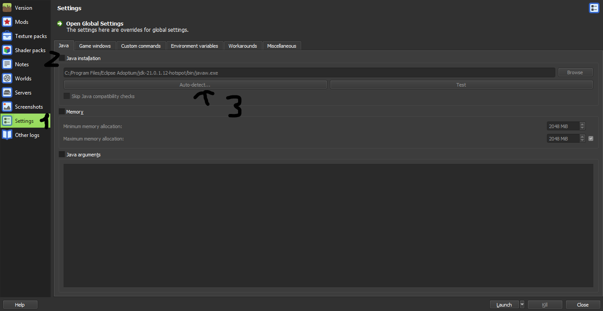
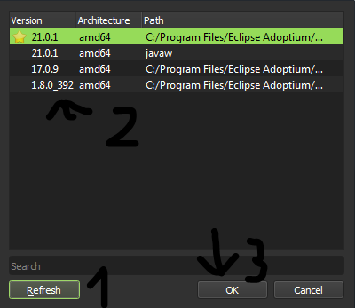
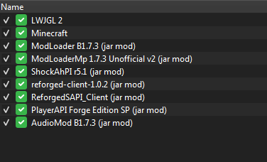
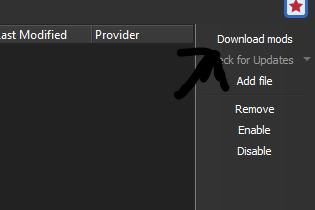

## Beta 1.7.3

### Introduction

There are two main ways of modding Beta 1.7.3: Risugami's ModLoader and Babric.

* Risugami's ModLoader (RML): The first proper modloader created by Risugami. Most mods from this era (2011) were made for this loader.
* Babric: A modern and (objectively) better alternative to RML. A fork of Fabric Loader.

Both of these loaders have different mod structures and different installation methods. Depending on your use case you might want to go with one of them.

* If you just want to play with 2011 mods, go with Risugami's ModLoader. Do note that installing mods for this loader is an involving task most of the time.
* If you a developer and want to develop mods instead, go with Babric.

### Risugami's ModLoader

### Things to note

* Jarmod (base class edits)'s order ***IS*** important. This is to make sure you don't overwrite any important classes from base mods such as ModLoader and Forge.
* **Only** Java 8 is supported due to internal changes in Java 9 and newer.
* Multiplayer is generally a hit-or-miss here. Mods are required to be coded specifically for multiplayer in order for it to work properly, and for many older mods this was not the case at all. Some community-made patches can fix those issues however you are largely on your own with this.

### 1. Creating an instance

Click the "Add Instance" button on the top left corner, then select `b1.7.3` as the version.

After that, click Edit and adjust the Java version of your instance like below.

You may also adjust other properties such as memory allocation here (older versions of the game shouldn't need more than 2 GB of RAM.)

Launch the game at least once to make sure it all works.

### 2. Installing RML and Friends

*All mods mentioned here can be obtained from [MCArchive](https://mcarchive.net/mods?gvsn=b1.7.3&author=&kw=) unless specifically noted (an URL will be given in that case.)*

Download the following mods and add them to your instance (using the `Add to Minecraft.jar` button) in this exact order:

* ModLoader
* ModLoaderMP
* [ShockAhPI r5.1](https://b2.mcarchive.net/file/mcarchive/64c46356598306497a154a10ddaaa98180963a5ff657426f4a300c130f1434d9/ShockAhPI%20r5.1.zip) (must be r5.1, r8 is not supported.) (copy all files in the `bin` folder to the root of the ZIP archive before adding it to the instance.)
* Minecraft Forge or [Reforged](https://github.com/Meefy777/Reforged/releases/download/1.0.2/reforged-client-1.0.2.zip) (the latter is recommended and is required for some mods, only install one.)
* (Only if Reforged is installed) [ReforgedSAPI](../mods/ReforgedSAPI_Client.zip)
* (Only if Minecraft Forge is installed) [ForgeSAPIMP](../../../mods/ForgeSAPIMP_Client_2.0.2.zip)
* [PlayerAPI](../../../mods/PlayerAPI%20Forge%20Edition%20SP.zip)
* AudioMod

Your instance should look like this in the end (with Reforged installed.)

Launch the game again after adding all mods, and if it launches without issues, congratulations!

You should be all set to start installing mods now!

### Babric

*Same steps may also applies to any legacy Fabric forks, but mod compatibility may not be guaranteed.*

### 1. Installing the Babric instance

Download the latest Babric instance [here](https://github.com/babric/prism-instance/releases).

Click the "Add Instance" button on the top left corner, then click "Import" and select the downloaded instance.

***Please use Java 17 for Babric instead of Java 8 to avoid compatibility issues.***

### 2. Installing Station API (optional)

Station API (or StAPI) is a general use API for Babric. It provides essential hooks, patches, and fixes to aid in modding the game.

If you are using Prism Launcher, installing StAPI is simple as using the built-in mod downloader to download it from Modrinth!

Additionally, you may download the latest in-development build of StAPI from [Jenkins](https://jenkins.glass-launcher.net/job/StationAPI/lastSuccessfulBuild/artifact/).

### 3. Playing with RML mods (unstable, experimental)

While compatibility and stability are not guaranteed, there's solutions for playing with RML mods on Babric (and optionally with StAPI too), one of them is Apron.

Apron is a compatibility layer for RML mods. It provides (re)implementations of RML, RMLMP and all related mods, allowings mods coded for it to works seemlessly on top of Babric without any changes.

> [!NOTE]
> Base edit mods generally have a lower chance of working properly if their respective base edits has not been implemented in Apron. Additionally, you are still being limited by codebase limitations if you use Apron with plain Babric.

Install Apron like you did with any other Babric mods. RML mods can be installed by dropped them into the `mods` folder. Apron will automatically handle everything.

> [!WARNING]
> Using Apron with StAPI will allow it to ultilize some of StAPI's fixes such as flattening; however, compatibility cannot be assured and (as of time of writing this) mods that add new dimensions won't work.

### Recommended mods (Risugami's ModLoader)

Mods that you *should* install to make your life easier.
| Name | Description | Notes |
| ---- | ----------- | ----- |
| [InfSprites](https://www.mediafire.com/file/awdp2mazt7idfcr/%21%5BBeta_1.7.3%5D_InfSprites_2.0.jar/file) | Fixes the sprite limit problem. Allows for unlimited sprite IDs. | Install into the `mods` folder, and do **not** rename the JAR. Requires [OverrideAPI](https://www.mediafire.com/file/987zper45s008oq/%5BBeta_1.7.3%5D_OverrideAPI_v1.0.1_01.jar/file) (install into the `mods` folder.) |
| [IDResolver](../../../mods/ID_Resolver_Update_3_Minecraft_Forge_Edition_b173.zip) | Makes dealing with item/block IDs conflict less of a pain by allowing you to manually allocate IDs. | Install as a jarmod ***after*** ShockAhPI, Forge/Reforged and their respective patch (ForgeSAPIMP/ReforgedSAPI). Require [this](../../../mods/Reforged_v1.0.2-IDResolver_Patch.zip) patch if used with Reforged (install as a jarmod ***after*** IDResolver.) |
| [NoCrashes (depth fix ver.)](https://mega.nz/folder/9UEU3awS#A6rOgu2tG5B64B-mnDxUbA/file/1ZkxQDbA) | Return to the main menu instead of crashing the game if there was an exception (anything that is not RuntimeException or internal Java errors.) | Install as a jarmod ***before*** everything else (before ModLoader.)

As a bonus, these mods *should* be avoided at all costs.

| Name | Reason | Viable Replacement |
| ---- | ------ | ------------------ |
| MCExtended | Breaks a lot of mods and is generally unstable. Incompatible with Reforged. | None |
| Minecraft Forge | Some mods doesn't support it. | Reforged |
