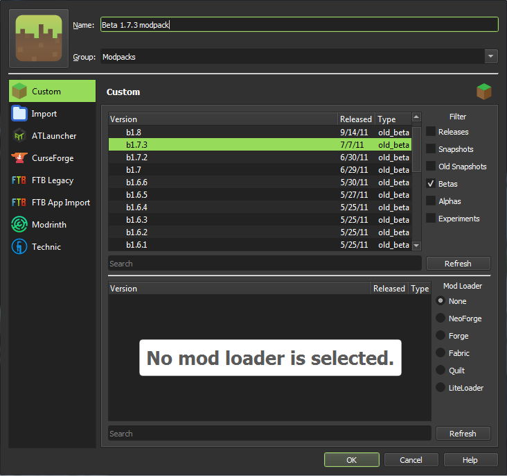
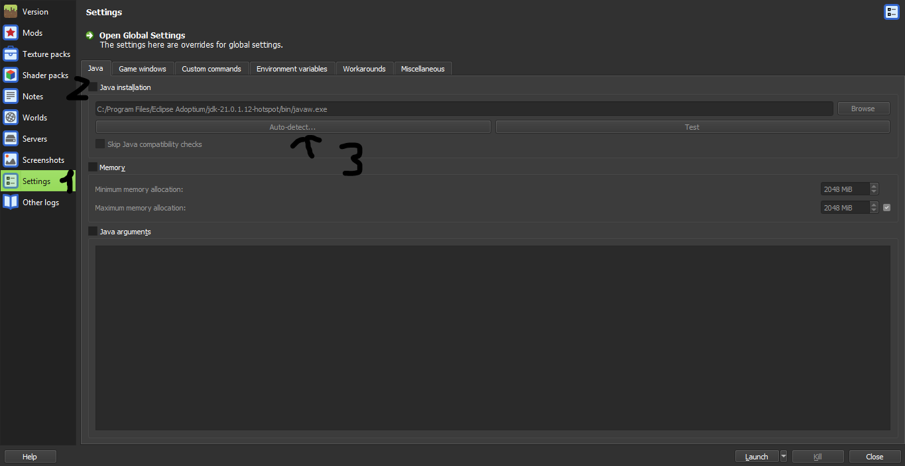
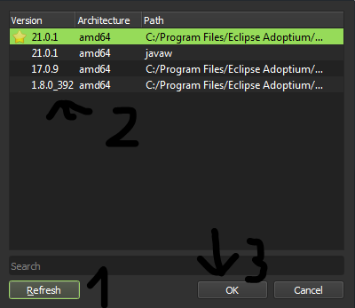
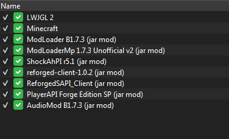
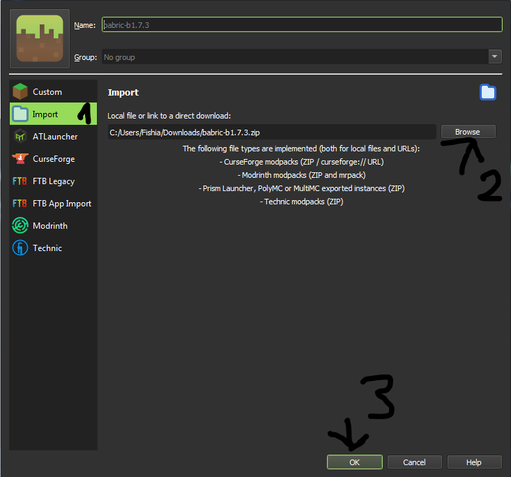
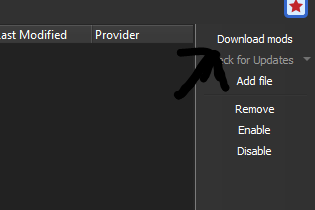
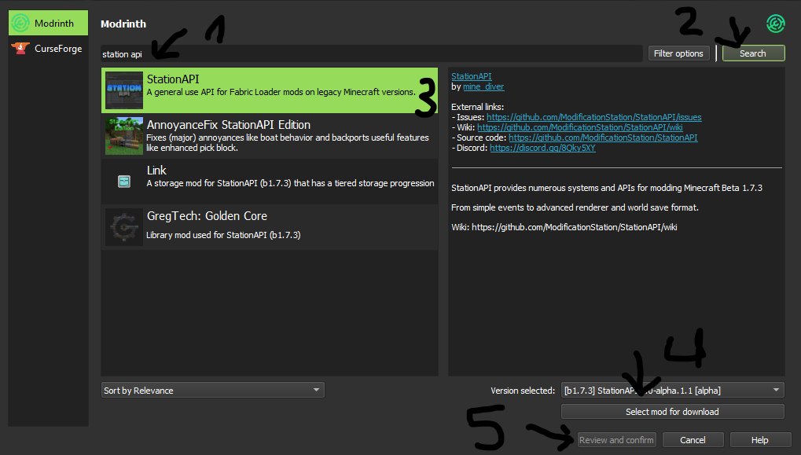

## Beta 1.7.3
### Introduction
There are two main ways of modding Beta 1.7.3: Risugami's ModLoader and Babric.
* Risugami's ModLoader (RML) is the main way of playing with mods as most were written to work with this modloader; however, it has a lot of issues regarding compatibility, and doing more complex stuff will often requires base class edits or special techniques such as ASM or proxying. This is the choice for most players who just want to play with old mods.
* Babric is the new, more powerful and more compatible way of modding Beta 1.7.3. Thanks to Mixin, complex modifications to the game can be done without much incompatibilities. Station API is (currently) the dominating API for Babric (think of it as Fabric API but for Beta) with new compatible APIs and multiple refactors to the game, fixing core problems affecting compatibility. Developing mods for Babric is significantly easier as the mod structure are almost identical to modern Fabric modding. This is the choice for mods developers, as it has a significantly worse mods library (at the moment).

If you choose RML, you won't be able to play with Babric mods; however, there are ways to play with (most) RML mods on Babric, which will be covered later on.
### Risugami's ModLoader
### 1. Things to note
* Jarmod (base class edits)'s order ***IS*** important. This is to make sure you don't overwrite any important classes from base mods such as ModLoader and Forge which can make troubleshoot much harder.
* Please use Java 8, and ***ONLY*** Java 8 as RML relies on some cursed black magic which were incompatible with Java 9+.
* Do not expect your mods to works fine in multiplayer. Unlike Babric which has a merged client+server codebase, RML requires separate mods for both client and server. Most mods that does not have dedicated server versions will **NOT** work without porting.
### 2. Creating an instance
Click the "Add Instance" button on the top left corner, then select `b1.7.3` as the version.

After that, click Edit and adjust the Java version of your instance like below.

You may also adjust other properties such as memory allocation here (older versions of the game shouldn't need more than 2 GB of RAM.)

Launch the game at least once to make sure it all works.
### 3. Installing RML and Friends
*All mods mentioned here can be obtained from [MCArchive](https://mcarchive.net/mods?gvsn=b1.7.3&author=&kw=) unless specifically noted (an URL will be given in that case.)*

Download the following mods and add them to your instance (using the `Add to Minecraft.jar` button) in this exact order:
* ModLoader
* ModLoaderMP
* [ShockAhPI r5.1](https://b2.mcarchive.net/file/mcarchive/64c46356598306497a154a10ddaaa98180963a5ff657426f4a300c130f1434d9/ShockAhPI%20r5.1.zip) (must be r5.1, r8 is not supported.) (copy all files in the `bin` folder to the root of the ZIP archive before adding it to the instance.)
* Minecraft Forge or [Reforged](https://github.com/Meefy777/Reforged/releases/download/1.0.2/reforged-client-1.0.2.zip) (the latter is recommended and is required for some mods, only install one.)
* (Only if Reforged is installed) [ReforgedSAPI](../mods/ReforgedSAPI_Client.zip)
* [PlayerAPI](../mods/PlayerAPI%20Forge%20Edition%20SP.zip)
* AudioMod

Your instance should look like this in the end.

Launch the game again after adding all mods, and if it launches without issues, congratulations!

You should be all set to start installing mods now! See the [obtaining mods](../obtaining-mods.md) page for more info.

### 2. Babric
### 1. Installing the Babric instance
Download the latest Babric instance [here](https://github.com/babric/prism-instance/releases).

Click the "Add Instance" button on the top left corner, then click "Import" and select the downloaded instance.

***Please use Java 17 for Babric instead of Java 8 to avoid compatibility issues.***
### 2. Installing Station API (optional)
After the above step, you should be all set to start installing mods; however, most mods are developed using StAPI (Station API), so it's recommended to install it to play with most content mods made for it. Another in-development API is BHAPI (Beta Horizons API), but since it's still in-development and there's little to no mods made for it yet, it's currently out-of-scope for this guide.

If you are using Prism Launcher, installing StAPI is simple as using the built-in mod downloader to download it from Modrinth!

For MultiMC/other launchers, download Station API from Modrinth and add it to the `mods` folder and you're all set!
### 3. Playing with RML mods (optional, experimental)
You can play with most RML mods using [Apron](https://github.com/FabricCompatibilityLayers/Apron), a compatibility layer for Risugami's ModLoader, Forge, and so on.

Please download Apron from GitHub by going into Actions tab and obtain the latest artifact (requires a GitHub account) for the time being as the release on Modrinth is severely outdated.

Install Apron like you did with StAPI, and additionally install your RML mods into the `mods` folder. No manual works are needed.

> [!WARNING]
> While Apron can be used in conjuction with StAPI, mod compatibility cannot be assured.